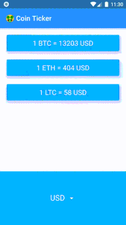

# Crypto Value

App realizada en flutter que permite ver el valor actual de las 3 principales criptomonedas (Bitcoin, Ethereum y Litecoin). Se conecta a la API de CoinAPI para obtener los valores vigentes.

